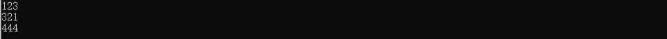
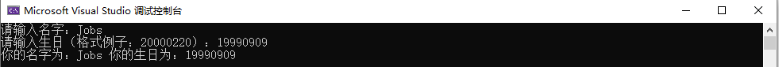
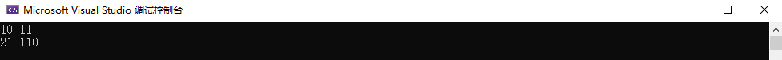
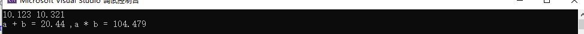
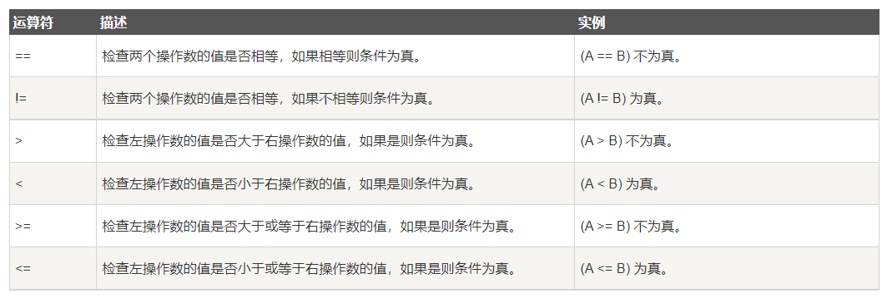
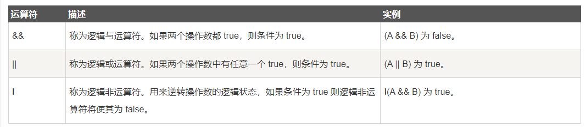
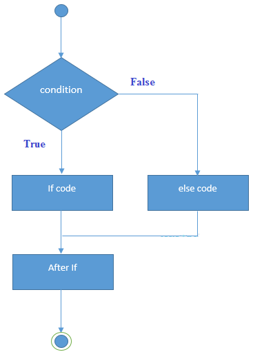
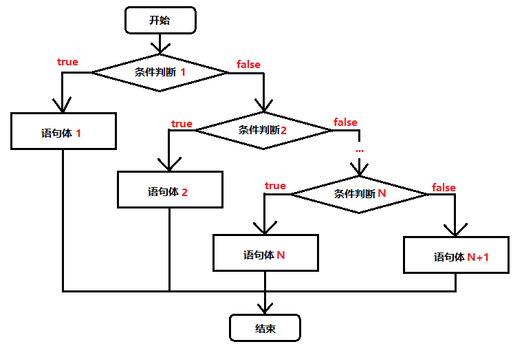
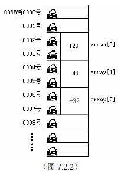

# AcWing-CPP-Notes
AcWing的C++语法课程的笔记

# C++：编译器

推荐使用的编译器是Visual Studio：


Visual Studio有Windows版本和Mac版本。Linux平台则推荐使用Sublime编辑器+GCC编译器。

在安装的时候选择：


语言默认为中文，有需求的可以选择比别的语言。

# C++：变量和输入输出

## 创建第一个Visual Studio项目

双击运行Visual Studio之后可以点击创建新项目：


然后选择空项目：


右键源文件，选择添加-新建项：


创建一个名为main.cpp的C++文件：


## Hello World 程序

接着我们可以在这个main.cpp文件中实现一个Hello World程序：

```cpp
#include <iostream>
using namespace std;

int main() {
	
	cout << "Hello World" << endl;

	return 0;
}
```

运行的结果为：

```cpp
Hello World
```

在这一段程序中，有这样的几个部分：

1. #include <iostream>：这是一个头文件，用来调用输入输出相关的文件
2. using namespace std：使用了std作为命名空间，关于什么是命名空间会在之后阐述
3. int main()函数：这个就是程序的主函数，程序会运行这个主函数中的内容
4. return 0：这个是int main()函数的返回值，可以用来告诉程序运行完成

这就是整个c++程序的框架了。

如果我们去掉std，则会报错：


## 变量与变量类型

变量是程序可操作的存储区的名称。

在C++语言中，每一个变量都会有指定的类型，类型决定了为这个变量开辟的内存空间的大小和布局，只要一个值不超过该范围，就可以被存储在这个内存空间上。

变量的名称：

1. 字母，数字和下划线字符组成
2. 以字母或者下划线开头
3. 大小写敏感（如：A和a在C++中就是不同的）

C++中常用的变量类型有：

1. bool：存储true或者false，false可以用0表示，true可以用1表示
2. char：通常是一个字符
3. int：整数类型
4. float：单精度浮点数，有效数字为6位数
5. double：双精度浮点数，有效数字为15位
6. void：表示类型的缺失

我们可以用程序来尝试一下上面的这些变量类型：

```cpp
#include <iostream>
using namespace std;

void main() {
	
	cout << "Hello World" << endl;

	bool TF1 = true;
	bool TF2 = false;
	cout << TF1 << " " << TF2 << endl;

	char a = 'A';
	cout << a << endl;

	int num = 123;
	cout << num << endl;

	float num2 = 3.14159;
	cout << num2 << endl;

	double num3 = 3.1415926535;
	cout << num3 << endl;

}
```

在这个程序当中，我们首先将int main()函数改成了void main()函数，这样一来这个函数的类型就是缺失的，也就不需要有返回值，所以我们去掉了return 0；接着我们创建了各种类型的变量，并且将这些变量打印了出来。

得到的结果为：

```cpp
Hello World
1 0
A
123
3.14159
3.14159
```

我们发现了一个问题，那就是float类型的变量num2和double类型的变量num3的输出结果都是3.14159，这是因为C++编译器默认的输出位数的问题。

如果我们希望将所有位数的数字都输出出来，我们可以这么做：

```cpp
#include <iostream>
#include <iomanip>

using namespace std;

void main() {

	double num3 = 3.1415926535;
	cout << setprecision(15) << num3 << endl;

}
```

如此，输出的结果为：

```cpp
3.1415926535
```

我们这里再讲一下string字符串类型和如何求取不同类型的变量所开辟的内存大小：

```cpp
#include <iostream>

using namespace std;

int main() {

	string str1 = "Hello";

	cout << sizeof(str1) << endl;
	
	return 0;
}
```

运行结果为：

```cpp
40
```

首先我们这里使用的是字符串，在C++语言中，如果我们要使用字符串，可以使用string来声明类型，接着我们使用到了sizeof，sizeof实际上是一个关键字，而不是函数，很多人会将sizeof误解为sizeof()函数，但是实际上只是sizeof关键字，()是用来将变量名和关键字区分开来而已。

从结果上来讲，c++语言为字符串开辟的空间为40个字节。

## 输入输出

我们来实现一个程序，这个程序会接受两个被输入的数字，然后将其相加，并且将相加的结果输出出来：

```cpp
#include <iostream>
using namespace std;

int main() {

	int a, b;

	cin >> a >> b;

	cout << a + b << endl;

	return 0;
}
```

运行的结果为：



我们首先需要包含iostream头文件，该文件定义了 cin、cout、cerr和 clog对象，分别对应于标准输入流、标准输出流、非缓冲标准错误流和缓冲标准错误流。

接着我们声明了两个整型的变量a和b，接着我们使用cin语句：

```cpp
cin >> a >> b;
```

这意味着向a，向b种传入输入的数据。

连续的输出才会被认为是输入给一个变量的，换行和空格都可以起到标识一个数字的输入已经结束了的作用：


接着是我们使用cout语句：

```cpp
cout << a + b << endl;
```

这个语句将会输出两个endl之前的内容。

需要注意的地方在于：

```cpp
cin >>
```

是用来表示输入的。

而：

```cpp
cout <<
```

则是用来表示输出的。

我们可以理解为cin是c-in，in表示的是进入；cou是c-out，out表示的是出来。

我们来尝试多个不同类型的变量的输入和输出：

```cpp
#include <iostream>
using namespace std;

int main() {

	string name;

	int birthday;

	cout << "请输入名字：";
	cin >> name;

	cout << "请输入生日（格式例子：20000220）：";
	cin >> birthday;

	cout << "你的名字为：" << name << " " << "你的生日为：" << birthday << endl;

	return 0;
}
```

结果为：



我们接着使用scanf和printf来实现一下cin和cout的功能：

```cpp
#include <iostream>
#include <cstdio>

using namespace std;

int main() {

	int a, b;

	scanf("%d%d", &a, &b);

	printf("%d %d\n", a + b, a * b);

	return 0;
}
```

结果为：



在这段代码中：”%d%d”表示会接受两个整数类型的输入，需要注意的是变量a和b的前面需要添加符号：&，如果缺失了这个符号则会报错。

使用scanf和printf的好处在于，我们可以直接选择输出的格式：

```cpp
#include <iostream>
#include <cstdio>

using namespace std;

int main() {

	int a, b;

	scanf_s("%d%d", &a, &b);

	printf("a + b = %d ,a * b = %d\n", a + b, a * b);

	return 0;
}
```

需要注意的地方在于，有时候这个代码会报错：


这是因为新版vs系列认为scanf不安全，使用存在安全隐患，所以给出了报错。

这个时候我们可以将scanf改成scanf_s，就能够成功的通过编译了：

```cpp
#include <iostream>
#include <cstdio>

using namespace std;

int main() {

	int a, b;

	scanf_s("%d%d", &a, &b);

	printf("%d %d\n", a + b, a * b);

	return 0;
}
```

接着我们来测试一下float类型的变量：

```cpp
#include <iostream>
#include <cstdio>

using namespace std;

int main() {

	float a, b;

	scanf_s("%f%f", &a, &b);

	printf("a + b = %.2f ,a * b = %.3f\n", a + b, a * b);

	return 0;
}
```

运行的结果为：



%.2f表示单精度浮点类型小数点后保留两位数，%.3f单精度浮点类型小数点后保留3位数。

两者的区别在于：

1. 能够使用cin和cout的地方一定是能够使用scanf和printf；但是能够使用scanf和printf的地方，不一定能够使用cin和cout
2. scanf和printf的效率是远高于cin和cout的

常见的输出字符串有：


# C++：运算符

## 运算符

C++支持常用的7种运算符。

假设变量 A 的值为 10，变量 B 的值为 20


测试程序为：

```cpp
#include <iostream>
using namespace std;

int main()
{
	int a = 21;
	int b = 10;
	int c;

	c = a + b;
	cout << "Line 1 - c 的值是 " << c << endl;
	c = a - b;
	cout << "Line 2 - c 的值是 " << c << endl;
	c = a * b;
	cout << "Line 3 - c 的值是 " << c << endl;
	c = a / b;
	cout << "Line 4 - c 的值是 " << c << endl;
	c = a % b;
	cout << "Line 5 - c 的值是 " << c << endl;

	int d = 10;   //  测试自增、自减
	c = d++;
	cout << "Line 6 - c 的值是 " << c << endl;

	d = 10;    // 重新赋值
	c = d--;
	cout << "Line 7 - c 的值是 " << c << endl;
	return 0;
}
```

关于取模%，我们需要额外的注意：

```cpp
#include <iostream>
using namespace std;

int main()
{
	cout << -5 % 2 << endl;
	cout << -5 % -2 << endl;
	cout << 5 % 2 << endl;
	cout << 5 % -2 << endl;

	return 0;
}
```

运行的结果为：

```cpp
-1
-1
1
1
```

从数学上来讲，5/-2=2......-1，因为（-2*2）+（-1）= -5。

但是从计算机的角度来讲，被除数的符号决定了余数的符号。

## 关系运算符

假设变量 A 的值为 10，变量 B 的值为 20，则：



程序测试为：

```cpp
#include <iostream>
using namespace std;

int main()
{
    int a = 21;
    int b = 10;
    int c;

    if (a == b)
    {
        cout << "Line 1 - a 等于 b" << endl;
    }
    else
    {
        cout << "Line 1 - a 不等于 b" << endl;
    }
    if (a < b)
    {
        cout << "Line 2 - a 小于 b" << endl;
    }
    else
    {
        cout << "Line 2 - a 不小于 b" << endl;
    }
    if (a > b)
    {
        cout << "Line 3 - a 大于 b" << endl;
    }
    else
    {
        cout << "Line 3 - a 不大于 b" << endl;
    }
    /* 改变 a 和 b 的值 */
    a = 5;
    b = 20;
    if (a <= b)
    {
        cout << "Line 4 - a 小于或等于 b" << endl;
    }
    if (b >= a)
    {
        cout << "Line 5 - b 大于或等于 a" << endl;
    }
    return 0;
}
```

运行结果为：

```cpp
Line 1 - a 不等于 b
Line 2 - a 不小于 b
Line 3 - a 大于 b
Line 4 - a 小于或等于 b
Line 5 - b 大于或等于 a
```

## **逻辑运算符**

假设变量 A 的值为 1，变量 B 的值为 0。



测试程序为：

```cpp
#include <iostream>
using namespace std;
 
int main()
{
   int a = 5;
   int b = 20;
   int c ;
 
   if ( a && b )
   {
      cout << "Line 1 - 条件为真"<< endl ;
   }
   if ( a || b )
   {
      cout << "Line 2 - 条件为真"<< endl ;
   }
   /* 改变 a 和 b 的值 */
   a = 0;
   b = 10;
   if ( a && b )
   {
      cout << "Line 3 - 条件为真"<< endl ;
   }
   else
   {
      cout << "Line 4 - 条件不为真"<< endl ;
   }
   if ( !(a && b) )
   {
      cout << "Line 5 - 条件为真"<< endl ;
   }
   return 0;
}
```

运行结果为：

```cpp
Line 1 - 条件为真
Line 2 - 条件为真
Line 4 - 条件不为真
Line 5 - 条件为真
```

## Condition运算符

condition运算符的语法为：

```cpp
Condition ? X : Y
```

这可以被理解为：

```cpp
如果 Condition 为真 ? 则值为 X : 否则值为 Y。
```

程序为：

```cpp
#include <iostream>
using namespace std;

int main()
{
	// 局部变量声明
	int x, y = 10;

	x = (y < 10) ? 30 : 40;

	cout << "value of x: " << x << endl;

	return 0;
}
```

运行的结果为：

```C++
value of x: 40
```

# C++：条件判断

## 判断语句

判断语句的逻辑如下所示：



首先给出一个条件判断语句，如果条件判断为真，则执行某一部分的代码，如果条件判判断结果为假，则执行另一部的代码。

## if语句与if-else语句

我们可以写一个简单的if语句程序：

```cpp
# include <iostream>
using namespace std;

int main()
{

	int score = 60;

	if (score >= 60) {
		cout << "恭喜你，及格了" << endl;
	}
	else {
		cout << "很抱歉，你没有及格" << endl;
	}

	int grade = 50;
	if (grade >= 60) {
		cout << "恭喜你，你及格了" << endl;
	}

	if (grade < 60) {
		cout << "很抱歉，你没有及格" << endl;
	}

	return 0;
}
```

运行的结果为：

```cpp
恭喜你，及格了
很抱歉，你没有及格
```

## 嵌套if语句

嵌套if语句的逻辑如下所示：



以之前的程序为例，我们将60分作为了成绩是否及格的标准线，但是对于60分或者以上的分数的人，我们还需要进行进一步的区分：

```cpp
#include <iostream>
using namespace std;

int main()
{
	int grade = 92;

	if (grade < 60) {
		cout << "不及格" << endl;
	}
	else {
		if (grade < 70) {
			cout << "及格" << endl;
		}
		else  if (70 <= grade && grade < 80) {
			cout << "良好" << endl;
		}
		else {
			cout << "优秀" << endl;
		}
	}
	return 0;
}
```

运行的结果为：

```cpp
优秀
```

其实我们也可以这么写：

```cpp
#include <iostream>
using namespace std;

int main()
{
	int grade = 92;

	if (grade < 60) {cout << "不及格" << endl;}
	else if (60 <= grade && grade < 70) {cout << "及格" << endl;}
	else  if (70 <= grade && grade < 80) {cout << "良好" << endl;}
	else {cout << "优秀" << endl;}

	return 0;
}
```

## switch语句

switch语句的逻辑结构如下所示：


语法如下所示：

```cpp
switch(expression){
    case constant-expression  :
       statement(s);
       break; // 可选的
    case constant-expression  :
       statement(s);
       break; // 可选的
  
    // 您可以有任意数量的 case 语句
    default : // 可选的
       statement(s);
}
```

**switch** 语句必须遵循下面的规则：

1. **switch** 语句中的 **expression** 必须是一个整型或枚举类型，或者是一个 class 类型，其中 class 有一个单一的转换函数将其转换为整型或枚举类型。
2. 在一个 switch 中可以有任意数量的 case 语句。每个 case 后跟一个要比较的值和一个冒号。
3. case 的 **constant-expression** 必须与 switch 中的变量具有相同的数据类型，且必须是一个常量或字面量。
4. 当被测试的变量等于 case 中的常量时，case 后跟的语句将被执行，直到遇到 **break** 语句为止。
5. 当遇到 **break** 语句时，switch 终止，控制流将跳转到 switch 语句后的下一行。
6. 不是每一个 case 都需要包含 **break**。如果 case 语句不包含 **break**，控制流将会 *继续* 后续的 case，直到遇到 break 为止。
7. 一个 **switch** 语句可以有一个可选的 **default** case，出现在 switch 的结尾。default case 可用于在上面所有 case 都不为真时执行一个任务。default case 中的 **break** 语句不是必需的。

我们尝试着将之前的程序修改成switch语句：

```cpp
#include <iostream>
using namespace std;

int main()
{
	int grade = 'A';

	switch (grade) {
	case 'A':
		cout << "优秀" << endl;
		break;
	case 'B':
		cout << "良好" << endl;
		break;
	case 'C':
		cout << "及格" << endl;
		break;
	case 'D':
		cout << "不及格" << endl;
		break;
	default:
		cout << "无效成绩" << endl;
	}
	return 0;
}
```

输出的结果为：

```cpp
优秀
```

我们来实现一个经典的闰年判断的代码：

```cpp
#include <iostream>
using namespace std;

int main()
{
	int year;
	cin >> year;

	if (year % 4 == 0) {

		if (year % 100 == 0) {
			if (year % 400 == 0) {
				cout << year << ", 是闰年" << endl;
			}
			else {
				cout << year << ", 不是闰年" << endl;
			}
		}
		else {
			cout << year << ", 是闰年" << endl;
		}
	}
	else {
		cout << year << ", 不是闰年" << endl;
	}

	return 0;
}
```

闰年需要被四整出，由此我们可以推导出能够被四整出和不能够被四整出的两种情况；能够被四整除的年份里面，如果是百年，则分为能够被四百年整出和不能够被四百年整出两种情况。

或者我们也可以这么写：

```cpp
#include <iostream>
using namespace std;

int main()
{
	int year;
	cin >> year;

	if (year % 4) {
		if (year % 100 == 0 && year % 400 == 0) {
			cout << year << ",是闰年" << endl;
		}
		else if (year % 100 == 0 && year % 400 != 0) {
			cout << year << ", 不是闰年" << endl;
		}
		else {
			cout << year << ",不是闰年" << endl;
		}
	}
	else {
		cout << year << ",不是闰年" << endl;
	}

	return 0;
}
```

或者我们也可以这么写：

```cpp
#include <iostream>
using namespace std;

int main()
{
	int year;
	cin >> year;

	if (year % 4 == 0 && year % 100 != 0 || year % 400 == 0) {
		cout << year << ", 是闰年" << endl;
	}
	else {
		cout << year << ", 不是闰年" << endl;
	}

	return 0;
}
```

# C++：循环

## 三种循环

C++语言中有三种循环：

| 循环类型        | 描述                                                         |
| --------------- | ------------------------------------------------------------ |
| while 循环      | 当给定条件为真时，重复语句或语句组。它会在执行循环主体之前测试条件。 |
| for 循环        | 多次执行一个语句序列，简化管理循环变量的代码。               |
| do...while 循环 | 除了它是在循环主体结尾测试条件外，其他与 while 语句类似。    |
| 嵌套循环        | 您可以在 while、for 或 do..while 循环内使用一个或多个循环。  |

这三种循环如图所示：


## while循环

我们可以写一段代码来将数字0~10打印出来：

```cpp
#include <iostream>
using namespace std;

int main()
{
	int num = 0;

	while (num <= 10) {
		cout << num << endl;
		num++;
	}

	return 0;
}
```

运行的结果为：

```cpp
1
2
3
4
5
6
7
8
9
10
```

需要注意的地方在于，我们while代码种需要有一行代码能够修改while代码的判断条件，并且使该条件的判断结果最终为false，否则会导致while代码的无限循环。

或者我们可以使用break语句来让while循环终止：

```cpp
#include <iostream>
using namespace std;

int main()
{
	int num = 0;

	while (num <= 10) {

		cout << num << endl;
		
		if (num == 5) {
			break;
		}
		else {
			num++;
		}

	}

	return 0;
}
```

结果为：

```cpp
0
1
2
3
4
5
```

break可以立刻从循环中跳出来。

## for循环

我们修改一下上面的while循环种的语句，将其修改成for循环：

```cpp
#include <iostream>
using namespace std;

int main()
{

	for (int a = 0; a <= 10; a++) {
		cout << a << endl;
	}

	return 0;
}
```

首先我们生成一个int类型的变量a并且让其等于0；接着我们让a的值小于等于10的时候会执行for循环中的代码；最后每次执行for循环的代码，a的值都会增加1。

运行的结果为：

```cpp
0
1
2
3
4
5
6
7
8
9
10
```

## do while循环

**do...while** 循环与 while 循环类似，但是 do...while 循环会确保至少执行一次循环。

C++ 中 **do...while**循环的语法：

```cpp
do
{
   statement(s);

}while( condition );
```

条件表达式出现在循环的尾部，所以循环中的 statement(s) 会在条件被测试之前至少执行一次。

代码如下所示：

```cpp
#include <iostream>
using namespace std;

int main()
{
	int num = 0;

	do {
		cout << num << endl;
		num++;
	} while (num < 10);

	return 0;
}
```

运行的结果为：

```cpp
0
1
2
3
4
5
6
7
8
9
```

## continues语句

C++ 中的 continue 语句有点像 break 语句。但它不是强迫终止，continue 会跳过当前循环中的代码，强迫开始下一次循环。

逻辑如下图所示：


我们写一段代码：

```cpp
#include <iostream>
using namespace std;

int main()
{
	int num = 0;

	while (num < 10) {
		
		if (num == 5) {
			num++; 
			continue;
		}

		cout << num << endl;
		num++;
	}

	return 0;
}
```

其结果如下所示：

```cpp
0
1
2
3
4
6
7
8
9
```

可以发现5被跳过去了，但是num==5的时候这个循环不会被强制终止。

# C++：数组

## 数组

C++ 支持数组数据结构，它可以存储一个固定大小的相同类型元素的顺序集合。数组是用来存储一系列数据，但它往往被认为是一系列相同类型的变量。

```cpp
type arrayName [ arraySize ];
```

叫做一维数组。arraySize必须是一个大于零的整数常量，type可以是任意有效的 C++ 数据类型。

我们可以生成一个int类型的数组：

```cpp
#include <iostream>
using namespace std;

int main()
{
	int numArray[5] = { 1, 2, 3, 4, 5 };
	for (int i = 0; i <= 4; i++) {
		cout << numArray[i] << endl;
	}
	
	return 0;
}
```

输出结果为：

```cpp
1
2
3
4
5
```

需要注意的地方在于，数组的第一元素的索引是0而不是1。

初始化数组有两种方式：

```cpp
#include <iostream>
using namespace std;

int main()
{
	int numArray[5] = { 1, 2, 3, 4, 5 };
	int numArray2[] = {1, 2, 3, 4, 5};
	
	return 0;
}
```

第一种方法是在声明的时候就给定了数组的大小，而第二种方法则没有给定数组的大小，但是数组的大小是声明这个数组时候初始化的元素的个数。

我们可以来看一下没有初始化元素的情况：

```cpp
#include <iostream>
using namespace std;

int main()
{
	int num[5] = {1, 2, 3};
	for (int i = 0; i <= 4; i++) {
		cout << num[i] << endl;
	}
	
	return 0;
}
```

运行的结果为：

```cpp
1
2
3
0
0
```

可以发现，如果初始化的时候没有给出具体的值，那么该元素则是默认为0。

利用这一点，我们可以初始化一个元素全为0的数组：

```cpp
int num[5] = {0};
```

那要是只给出了声明了数组和给出了数组的大小呢？

```cpp
#include <iostream>
using namespace std;

int main()
{
	int num[6];

	for (int i = 0; i <= 5; i++) {
		cout << num[i] << endl;
	}
	
	return 0;
}
```

运行的结果为：

```cpp
-858993460
-858993460
-858993460
-858993460
-858993460
-858993460
```

实际上这些数字都是随机给出来的。

变量和数组都是存在内存空间中的，在内存里的房子的大小是规定的，每幢房子只能存储一个字节（Byte）的数据。

有时候，一种类型的变量需要比较大的空间，比如一个浮点型的实数，一幢房子是放不下的，而是需要4幢房子的空间才能放得下。于是电脑就把连起来的4幢房子拼起来，每幢房子放这个实数的一部分数据。而这连起来的4幢房子，构成了一个能够存放浮点型实数的变量。


数组在内存中则是由若干个相邻的数组元素按顺序拼接而成的。每个数组元素又相当于一个变量。图是一个大小为3的短整型（short）数组在内存中的情况。



所以在C++语言中，一旦一个数组的大小被确定了，就不能够扩张这个数组的大小了，因为这个数组所使用的内存空间的下一个相邻的内存空间可能已经被使用了。

先前我们使用了这样的一行代码：

```cpp
	int numArray2[] = {1, 2, 3, 4, 5};
```

在现实中我们可能不清楚一个数组的大小，因为没有给出明确的大小，我们也无法查看生成数组的代码，这个时候我们需要使用sizeof来进行求取：

```cpp
#include <iostream>
using namespace std;

int main()
{
	int numArray2[] = { 1, 2, 3, 4, 5 };

	cout << sizeof(numArray2) / sizeof(numArray2[0]) << endl;
	
	return 0;
}
```

得到的结果为：

```cpp
5
```

## 二维数组

C++ 支持多维数组。多维数组声明的一般形式如下：

```cpp
type name[size1][size2]...[sizeN];
```

多维数组最简单的形式是二维数组。一个二维数组，在本质上，是一个一维数组的列表。声明一个 x 行 y 列的二维整型数组，形式如下：

```cpp
type arrayName [ x ][ y ];
```

下面是一个二维数组，包含 3 行和 4 列：


因此，数组中的每个元素是使用形式为 a[ i , j ] 的元素名称来标识的，其中 a 是数组名称，i 和 j 是唯一标识 a 中每个元素的下标。

我们可以实现一个程序：

```cpp
#include <iostream>
using namespace std;

int main()
{
	int Array2D[3][4] = {
	{1, 2, 3, 4}, //0行
	{5, 6, 7, 8}, //1行
	{9, 10, 11, 12}, //2行
	};
	
	cout << Array2D[0][0] << endl;
	cout << Array2D[1][1] << endl;

	return 0;
}
```

运行的结果为：

```cpp
1
6
```

另一个程序：

```cpp
#include <iostream>
using namespace std;
 
int main ()
{
   // 一个带有 5 行 2 列的数组
   int a[5][2] = { {0,0}, {1,2}, {2,4}, {3,6},{4,8}};
 
   // 输出数组中每个元素的值                      
   for ( int i = 0; i < 5; i++ )
      for ( int j = 0; j < 2; j++ )
      {
         cout << "a[" << i << "][" << j << "]: ";
         cout << a[i][j]<< endl;
      }
 
   return 0;
}
```

运行的结果为：

```cpp
a[0][0]: 0
a[0][1]: 0
a[1][0]: 1
a[1][1]: 2
a[2][0]: 2
a[2][1]: 4
a[3][0]: 3
a[3][1]: 6
a[4][0]: 4
a[4][1]: 8
```

# C++：字符串

## C语言中的字符串

C++提供了两种类型的字符串：

1. c风格的字符串
2. C++引入的string类类型

C风格的字符串起源于C语言，并且在C++语言中得到了支持。

字符串实际上是用null字符\0终止的一维字符数组。因此，一个以 null 结尾的字符串，包含了组成字符串的字符。

我们可以尝试一下：

```cpp
#include <iostream>
 
using namespace std;
 
int main ()
{
   char site[7] = {'A', 'B', 'C', 'D', 'E', 'F', '\0'};
   cout << site << endl;
 
   return 0;
}
```

当上面的代码被编译和执行时，它会产生下列结果：

```cpp
ABCDEF
```

C++提供了大量的相关的函数：


我们可以随便测试一下：

```cpp
#define _CRT_SECURE_NO_DEPRECATE

#include <iostream>
#include <cstring>
using namespace std;

int main()
{
	char site[7] = { 'A', 'B', 'C', 'D', 'E', 'F', '\0'};

	char site2[7] = {'1', '2', '3','4', '5', '6', '\0'};

	strcpy(site, site2);

	cout << site << endl;

	return 0;
}
```

运行的结果为：

```cpp
123456
```

## **C++ 中的 String 类**

C++ 标准库提供了 **string**类类型，支持上述所有的操作，另外还增加了其他更多的功能。

我们可以尝试一下：

```cpp
#include <iostream>
#include <string>
 
using namespace std;
 
int main ()
{
   string str1 = "baidu";
   string str2 = "google";
   string str3;
   int  len ;
 
   // 复制 str1 到 str3
   str3 = str1;
   cout << "str3 : " << str3 << endl;
 
   // 连接 str1 和 str2
   str3 = str1 + str2;
   cout << "str1 + str2 : " << str3 << endl;
 
   // 连接后，str3 的总长度
   len = str3.size();
   cout << "str3.size() :  " << len << endl;
 
   return 0;
}
```

运行的结果为：

```cpp
str3 : baidu
str1 + str2 : baidugoogle
str3.size() :  11
```

compare函数：

```cpp
#include <iostream>
#include <string>

using namespace std;

int main()
{
	string str1 = "123";
	string str2 = "456";
	int result = str1.compare(str2);
	cout << result << endl;

	return 0;
}
```

运行结果为：

```cpp
-1
```

compare的原理为：两个字符串自左向右逐个字符相比（按ASCII值大小相比较），直到出现不同的字符或遇’\0’为止。

substr 成员函数可以用于求子串 (n, m)，原型如下：

```cpp
#include <iostream>
#include <string>

using namespace std;

int main()
{
	string s1 = "this is ok";
	string s2 = s1.substr(2, 4);  // s2 = "is i"

	cout << s2 << endl;

	return 0;
}
```

结果为：

```cpp
is i
```

或者我们可以直接交换两个字符串：

```cpp
#include <iostream>
#include <string>

using namespace std;

int main()
{
	string s1("West"), s2("East");
	s1.swap(s2);  // s1 = "East"，s2 = "West"

	cout << s1 << endl;
	cout << s2 << endl;

	return 0;
}
```

运行的结果为：

```cpp
East
West
```

string 类有一些查找子串和字符的成员函数，它们的返回值都是子串或字符在 string 对象字符串中的位置（即下标）。如果查不到，则返回 string::npos。string: :npos 是在 string 类中定义的一个静态常量。这些函数如下：

- find：从前往后查找子串或字符出现的位置。
- rfind：从后往前查找子串或字符出现的位置。
- find_first_of：从前往后查找何处出现另一个字符串中包含的字符。例如：
- s1.find_first_of("abc"); //查找s1中第一次出现"abc"中任一字符的位置
- find_last_of：从后往前查找何处出现另一个字符串中包含的字符。
- find_first_not_of：从前往后查找何处出现另一个字符串中没有包含的字符。
- find_last_not_of：从后往前查找何处出现另一个字符串中没有包含的字符。

代码为：

```cpp
#include <iostream>
#include <string>
using namespace std;
int main()
{
    string s1("Source Code");
    int n;
    if ((n = s1.find('u')) != string::npos) //查找 u 出现的位置
        cout << "1) " << n << "," << s1.substr(n) << endl;
    //输出 l)2,urce Code
    if ((n = s1.find("Source", 3)) == string::npos)
        //从下标3开始查找"Source"，找不到
        cout << "2) " << "Not Found" << endl;  //输出 2) Not Found
    if ((n = s1.find("Co")) != string::npos)
        //查找子串"Co"。能找到，返回"Co"的位置
        cout << "3) " << n << ", " << s1.substr(n) << endl;
    //输出 3) 7, Code
    if ((n = s1.find_first_of("ceo")) != string::npos)
        //查找第一次出现或 'c'、'e'或'o'的位置
        cout << "4) " << n << ", " << s1.substr(n) << endl;
    //输出 4) l, ource Code
    if ((n = s1.find_last_of('e')) != string::npos)
        //查找最后一个 'e' 的位置
        cout << "5) " << n << ", " << s1.substr(n) << endl;  //输出 5) 10, e
    if ((n = s1.find_first_not_of("eou", 1)) != string::npos)
        //从下标1开始查找第一次出现非 'e'、'o' 或 'u' 字符的位置
        cout << "6) " << n << ", " << s1.substr(n) << endl;
    //输出 6) 3, rce Code
    return 0;
}
```

# C++：函数

每个 C++ 程序都至少有一个函数，即主函数 main() ，所有简单的程序都可以定义其他额外的函数。

函数声明告诉编译器函数的名称、返回类型和参数。函数定义提供了函数的实际主体。

C++ 中的函数定义的一般形式如下：

```cpp
return_type function_name( parameter list )
{
   body of the function
}
```

在 C++ 中，函数由一个函数头和一个函数主体组成。下面列出一个函数的所有组成部分：

1. 返回类型：一个函数可以返回一个值。return_type 是函数返回的值的数据类型。有些函数执行所需的操作而不返回值，在这种情况下，return_type 是关键字 void。
2. 函数名称：这是函数的实际名称。函数名和参数列表一起构成了函数签名。
3. 参数：参数就像是占位符。当函数被调用时，您向参数传递一个值，这个值被称为实际参数。
4. 数列表包括函数参数的类型、顺序、数量。参数是可选的，也就是说，函数可能不包含参数。
   函数主体：函数主体包含一组定义函数执行任务的语句。

我们可以写一个max函数：

```cpp
#include <iostream>
using namespace std;

// 函数声明
int max(int num1, int num2);

int main()
{
    // 局部变量声明
    int a = 100;
    int b = 200;
    int ret;

    // 调用函数来获取最大值
    ret = max(a, b);

    cout << "Max value is : " << ret << endl;

    return 0;
}

// 函数返回两个数中较大的那个数
int max(int num1, int num2)
{
    // 局部变量声明
    int result;

    if (num1 > num2)
        result = num1;
    else
        result = num2;

    return result;
}
```

运行的结果为：

```cpp
Max value is : 200
```

# C++：类和对象

定义一个类，本质上是定义一个数据类型的蓝图。这实际上并没有定义任何数据，但它定义了类的名称意味着什么，也就是说，它定义了类的对象包括了什么，以及可以在这个对象上执行哪些操作。


要创建一个类，需要使用关键字class：

```cpp
#include <iostream>
#include<cstring>
using namespace std;
class Person
{
   public:
        string name;
        int age;
        char sex;
};
int main()
{
   return 0;
}
```

接着我们可以使用类来生成对象：

```cpp
#include <iostream>
#include<cstring>
using namespace std;
class Person
{
   public:
        string name;
        int age;
        char sex;
};
int main()
{
    Person person1,person2;
    return 0;
}
```

类除了属性，可以有方法：

```cpp
#include <iostream>
#include<cstring>
using namespace std;
class Person
{
    string name;
    int age;
    char sex;
// 成员函数声明
public:
    void Register(string,int,char);
    void ShowMe();
    void Input();
    string ID;
};
// 成员函数定义
void Person::Register(string na,int ag,char se)
{
    name=na;
    age=ag;
    sex=se;
}
void Person::ShowMe()
{
    cout<<name<<" "<<age<<" "<<sex<<endl;
}
void Person::Input()
{
    cin>>name>>age>>sex;
 } 
int main()
{
    Person person1,person2;
    person1.Input();
    person2.Register("Zhang3",19,'m');
    person1.ShowMe();
    person2.ShowMe();
    return 0;
}
```

# C++：结构体/数据结构

C/C++ 数组允许定义可存储相同类型数据项的变量，但是**结构**是 C++ 中另一种用户自定义的可用的数据类型，它允许您存储不同类型的数据项。

结构用于表示一条记录，假设您想要跟踪图书馆中书本的动态，您可能需要跟踪每本书的下列属性：

- Title ：标题
- Author ：作者
- Subject ：类目
- Book ID ：书的 ID

为了定义结构，您必须使用 **struct** 语句。struct 语句定义了一个包含多个成员的新的数据类型，struct 语句的格式如下：

```cpp
struct type_name {
member_type1 member_name1;
member_type2 member_name2;
member_type3 member_name3;
.
.
} object_names;
```

type_name 是结构体类型的名称，member_type1 member_name1 是标准的变量定义，比如 int i; 或者 float f; 或者其他有效的变量定义。在结构定义的末尾，最后一个分号之前，您可以指定一个或多个结构变量，这是可选的。下面是声明一个结构体类型 Books，变量为 book：

```cpp
struct Books
{
   char  title[50];
   char  author[50];
   char  subject[100];
   int   book_id;
} book;
```

为了访问结构的成员，我们使用成员访问运算符（.）。成员访问运算符是结构变量名称和我们要访问的结构成员之间的一个句号。

我们来写一个结构体程序：

```cpp
#define _CRT_SECURE_NO_DEPRECATE

#include <iostream>
#include <cstring>

using namespace std;
void printBook(struct Books book);

// 声明一个结构体，必须要()
struct Books {

	char title[50]; // 书名
	char author[50]; //作者
	char subject[50]; //分类
	int book_int; // 书号

}; // 最后需要一个分号

void printBook(struct Books book)
{
	cout << "书标题 : " << book.title << endl;
	cout << "书作者 : " << book.author << endl;
	cout << "书类目 : " << book.subject << endl;
	cout << "书 ID : " << book.book_int << endl;
}

int main() {

	Books book1; // 通过结构体来声明一个结构体变量book1
	Books book2; // 通过结构体来声明一个结构体变量book2

	Books book3 = { "C++编程", "佚名", "C++编程", 1 }; // 在用结构体生成的时候直接初始化其中的元素

	//book1的详细信息
	strcpy(book1.title, "Python编程");
	strcpy(book1.author, "佚名");
	strcpy(book1.subject, "Python编程");
	book1.book_int = 2;

	//同理book2的详细信息
	strcpy(book2.title, "CSS 教程");
	strcpy(book2.author, "佚名");
	strcpy(book2.subject, "前端技术");
	book2.book_int = 12346;

	cout << book1.title << endl; //通过 . 的方式来获得这个结构体变量中的这个变量的值

	// 或者我们可以通过调用先前的函数来进行打印
	printBook(book2);
	printBook(book3);

	return 0;
}
```

运行的结果为：

```cpp
Python编程
书标题 : CSS 教程
书作者 : 佚名
书类目 : 前端技术
书 ID : 12346
书标题 : C++编程
书作者 : 佚名
书类目 : C++编程
书 ID : 1
```

或者我们也可以这么写：

```cpp
typedef struct Books
{
   char  title[50];
   char  author[50];
   char  subject[100];
   int   book_id;
}Books;
```

# C++：指针与引用

# 指针

每一个变量都有一个内存位置，每一个内存位置都定义了可使用连字号（&）运算符访问的地址，它表示了在内存中的一个地址：

```cpp
#include <iostream>
using namespace std;

int main() {

	int num = 10;

	cout << &num << endl;

	return 0;
}
```

运行的结果为：

```cpp
000000F1A978FB74
```

当我们使用：

```cpp
int num = 10;
```

的时候，我们声明了一个类型为int，名字为num，值为10的变量，而这个变量会有对应的内存空间进行存储，而使用&num则可以获取这个变量的内存空间的地址。

指针则是一个变量，存储的值是另一个变量的内存地址：

```cpp
#include <iostream>
using namespace std;

int main() {

	int num = 10;
	int* memoryAddress = &num;

	cout << &num << endl;
	cout << memoryAddress << endl;

	return 0;
}
```

运行的结果为：

```cpp
000000C37312F8D4
000000C37312F8D4
```

如果我们拥有了一个内存地址，那么我们可以使用*来访问这个内存地址中所存储的值：

```cpp
#include <iostream>
using namespace std;

int main() {

	int num = 10;
	int* memoryAddress = &num;

	cout << &num << endl;
	cout << memoryAddress << endl;

	cout << num << endl;
	cout << *memoryAddress << endl;

	return 0;
}
```

运行的结果为：

```cpp
0000005681AFF9D4
0000005681AFF9D4
10
10
```

下面列出了 C++ 程序员必须清楚的一些与指针相关的重要概念：


## 引用

引用变量是一个别名，也就是说，它是某个已存在变量的另一个名字。

引用很容易与指针混淆，它们之间有三个主要的不同：

- 不存在空引用。引用必须连接到一块合法的内存。
- 一旦引用被初始化为一个对象，就不能被指向到另一个对象。指针可以在任何时候指向到另一个对象。
- 引用必须在创建时被初始化。指针可以在任何时间被初始化。

我们可以写一段代码来尝试一下：

```cpp
#include <iostream>
using namespace std;

int main() {

	int num = 100; // 一个int类型的变量
	int& anotherName = num; //该变量的别名

	cout << num << endl;
	cout << anotherName << endl;

	num = 200; // 我们修改一下num变量的值
	cout << num << endl;
	cout << anotherName << endl;

	cout << &num << endl;
	cout << &anotherName << endl;

	return 0;
}
```

运行的结果为：

```cpp
100
100
200
200
00000072526FF894
00000072526FF894
```

可以发现，别名只是这一块内存空间的另一个名字，而不是生成了一个新的变量，也没有开辟一块新的内存空间。
